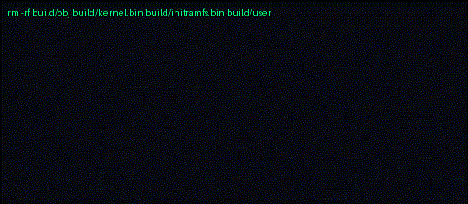

# OS/mosis

**A freestanding 32-bit x86 kernel seed on the path toward a modern 64-bit daily-driver OS.**

[](docs/PLATFORM.md)
[](manifesto.md)
[](manifesto.md)

### Baby Booties 🍼🤱👼


OS/mosis is one stack, one contract: the kernel and userland are designed together, with explicit boundaries and diagnostics that explain what the machine is doing.

Today, this repository contains a bootable freestanding i386 kernel with a small synchronous ring-3 demo. The long-term direction is a real Unix-derivative, modern 64-bit daily-driver system with FreeBSD as the intended lineage anchor. That is a destination, not a claim about the current code.

## What works today

- Multiboot startup, GDT/TSS setup, IDT exceptions, PIC/IRQ routing, PIT timing, and PS/2 keyboard input.
- VGA text output and mirrored serial diagnostics.
- Bootloader memory-map capture, a physical frame allocator, 4 KiB paging, and a small kernel heap.
- A buffered kernel shell with memory, paging, heap, timer, and read-only initramfs inspection commands.
- An embedded read-only initramfs generated during the build.
- A minimal ELF loader and synchronous ring-3 program using `int 0x80` for `write`, `exit`, and `getpid`.
- A headless QEMU verification path that fails the build when the user-mode demo does not exit cleanly.

Not implemented yet: a scheduler or process model, `fork`/`execve`/`waitpid`, writable or persistent storage, a userland shell, the x86_64 port, or FreeBSD-derived code/provenance.

## Build

The host-toolchain path needs GCC with 32-bit output support, GNU binutils, NASM, and Python 3:

```bash
make
```

The resulting kernel is `build/kernel.bin`. Generated objects, the user ELF, and the initramfs also stay under `build/`.

To use an i686 cross-toolchain instead:

```bash
make CROSS=i686-elf-
```

The Makefile still accepts explicit tool overrides such as `CC=clang`, `LD=ld.lld`, `OBJCOPY=llvm-objcopy`, or `NASM=/path/to/nasm`.

## Run and verify

Install `qemu-system-i386` (usually provided by a `qemu-system-x86` package), then run the automated headless check:

```bash
make qemu
```

That target rebuilds with QEMU verification enabled, boots headlessly, runs the ring-3 demo, and treats the guest's dedicated success code as the only passing result. A 15-second timeout turns a stalled guest into a failed check. The test-only build is cleaned afterward so a later plain `make` cannot accidentally reuse its instrumentation.

For the interactive kernel shell, build normally and launch the kernel without the verification flag:

```bash
./scripts/qemu.sh -kernel build/kernel.bin -serial stdio
```

The launcher never installs packages or changes the host. Set `QEMU_BIN` if the executable is not named `qemu-system-i386`.

The [boot-preview workflow](.github/workflows/boot-gif.yml) runs the same build and QEMU entrypoints on pushes and pull requests that affect the bootable system, then publishes the boot log and a rendered GIF as workflow artifacts.

## Repository map

- `src/arch/i386/` — i386 boot, descriptor tables, interrupts, devices, paging, and syscall entry.
- `src/kernel/` — shared kernel services, shell, VFS, and user-mode loader.
- `include/osmosis/` — public subsystem contracts; i386-only interfaces stay under `arch/i386/`.
- `user/` — the current freestanding ring-3 demo and its linker script.
- `initramfs/` — source files packed into the generated read-only initramfs.
- `scripts/` — initramfs generation, QEMU launch, and boot-GIF rendering.
- `build/linker.ld` — the only tracked file under `build/`; all other build contents are generated.
- `docs/` — architecture notes, ABI documentation, and roadmaps.
- `legacy/osmosis_repo/` — frozen historical flat-layout snapshot; not part of the active build.

See [STRUCTURE.md](STRUCTURE.md) for the active tree, [manifesto.md](manifesto.md) for project principles, [docs/ROADMAP.md](docs/ROADMAP.md) for sequencing, [docs/PLATFORM.md](docs/PLATFORM.md) for the architecture horizon, and [AGENTS.md](AGENTS.md) for contributor guidance.

## License

OS/mosis is available under the project-specific [OS/mosis License 1.0](LICENSE).
